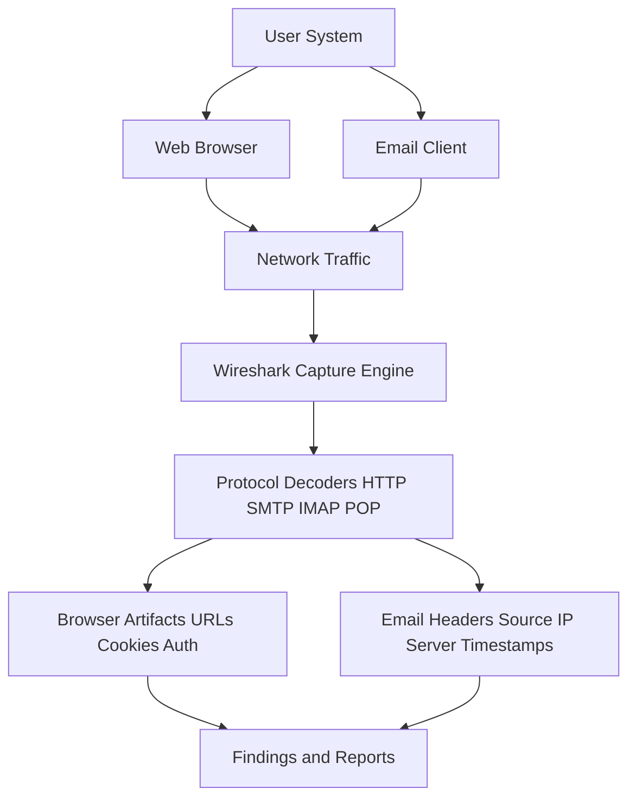
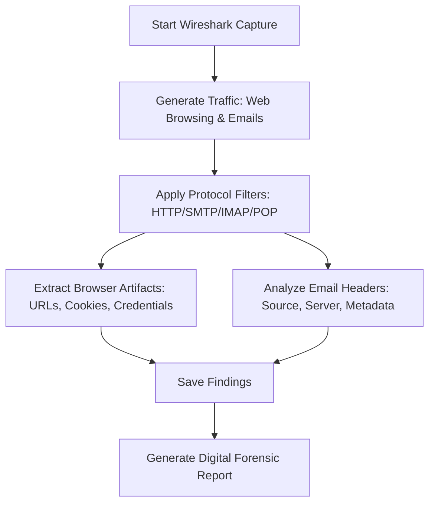

# Using-Wireshark---analyzing-web-browser-artifacts-email-header-analysis
## AIM:
To use Wireshark to analyze web browser activities and inspect email headers from captured network traffic.
## Architecture Diagram:

## DESIGN STEPS:
### Step 1:
- Install Wireshark and ensure correct network adapter selection.
- Enable packet capturing for your active interface (Wi-Fi/Ethernet).

### Step 2:
**Web Browser Artifact Analysis**
- Open a browser and visit websites with login forms (use dummy credentials).
- In Wireshark, filter traffic with:
    - ```http``` for normal HTTP requests
    - ```http.cookie``` for cookies
    - ```http.authbasic``` for basic authentication
- Identify:
    - URLs visited
    - GET/POST requests
    - Cookies & session IDs
    - Credentials (if plaintext HTTP is used)
### Step 3:
- Capture email traffic by sending/receiving emails (dummy mail server or provided PCAP).
- Use filters:
    - ```smtp``` (Simple Mail Transfer Protocol)
    - ```pop``` / ```imap``` (for received mail)
- Inspect email headers:
    - Source IP
    - Mail server hostname
    - Timestamps
    - Possible forged headers
## PROGRAM:


**A.Capturing Traffic in Wireshark**

+ Open Wireshark and start capturing on the active interface (Wi- Fi/Ethernet).


* Perform activities like opening a website or sending an email through a client (e.g., Gmail via browser or Thunderbird).


**B. Analyzing Web Browser Artifacts**


* Apply filters like: http, tcp.port == 443 (for HTTPS), or dns to isolate browser traffic.


* Inspect HTTP GET/POST requests: 
  - Look for URLs, hostnames, user agents, and cookies in the HTTP headers.
  - Follow TCP Stream to reconstruct page request flow: Right-click a packet → Follow → TCP Stream.
  - Filter: dns o Reveal domains the browser tried to resolve.


**C. Email Header Analysis**

* Apply relevant filters: 
  - For POP3: tcp.port == 110 o For SMTP: tcp.port == 25 or 587 o For IMAP: tcp.port == 143 or 993


* Locate email data: 
  - Look for SMTP packets to see sender/receiver email addresses.
  - Use "Follow TCP Stream" to view the full email headers and body if unencrypted.


* Extract Email Header Fields:
  - Analyze From, To, Subject, Date, Message-ID, and relay servers used in sending the email.


## OUTPUT:
Captured Web Activity and Email Header Information


## RESULT:
Web browser artifacts and email headers were successfully analyzed using Wireshark.

